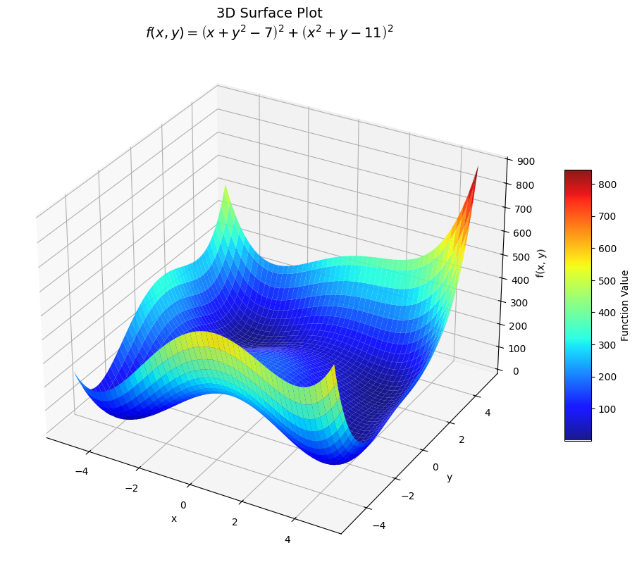
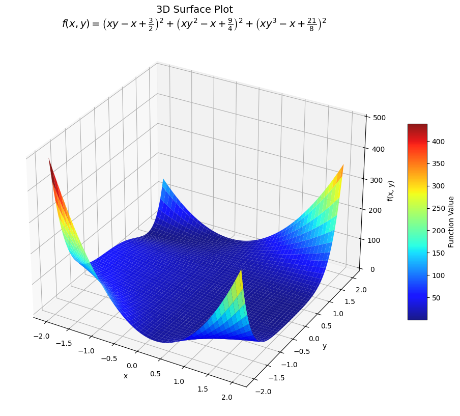
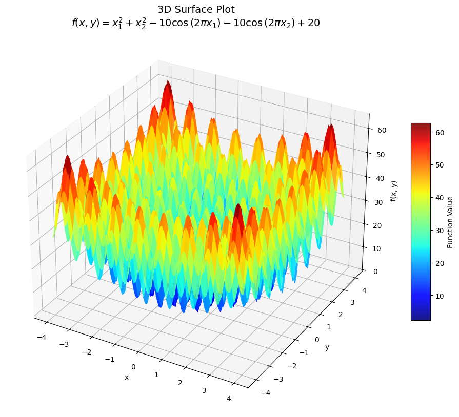

# Nonlinear Optimisation 

This project implements nonlinear optimisation methods, combining analytical and numerical techniques to solve unconstrained optimisation problems. It prioritises mathematical reasoning while ensuring computational efficiency and ease of use.

The solvers:
- Use symbolic computation where possible to maintain precision.
- Transition to numerical computation for tasks like solving linear systems and matrix decompositions.
- Provide outputs consistent with established libraries, such as SciPy, for benchmarking and integration.

Developed as an educational exercise, the project aims to deepen understanding of the mathematical foundations of optimisation while creating robust, reusable tools.

## Key Features

1. **Hybrid Analytical-Numerical Approach**:
   - Symbolic gradients and Hessians are used to reduce numerical inaccuracies.
   - Numerical techniques ensure efficiency in solving linear systems and handling decompositions.

2. **Custom Solver Classes**:
   - Includes Levenberg-Marquardt and Newton-Raphson methods, among others.
   - Provides results compatible with SciPy's optimisation routines for easy comparison.

3. **Benchmarking with Test Functions**:
   - Tested against well-known problems, such as Himmelblau's and Rastrigin's functions.
   - Evaluates performance metrics like convergence rate, accuracy, and robustness.

4. **Reproducibility**:
   - Features clearly documented code and examples to facilitate exploration and further development.
----

## Project Goal: Finding a Local Minimiser of a Mathematical Function

### Preliminaries: Scalar Fields, Functions of Two Variables

Let us consider the case where $f(\mathbf{x})$ is a scalar field with two variables:

$$z = f(x, y), \quad \mathbf{x} = (x, y)$$

Here, the gradient is:

$$\nabla f(\mathbf{x}) = \begin{pmatrix} f_x(\mathbf{x}) \\ f_y(\mathbf{x}) \end{pmatrix}$$

and the Hessian matrix is given:

$$\mathbf{H}(\mathbf{x}) = \begin{bmatrix} f_{xx}(\mathbf{x}) & f_{xy}(\mathbf{x}) \\
f_{yx}(\mathbf{x}) & f_{yy}(\mathbf{x})\end{bmatrix}$$

Now consider the second-order Taylor polynomial approximation $p_2(x, y)$ to $f(x, y)$ about a point $(a, b)$, namely:

$$
\begin{align}
p_2(x, y) &= f(a, b) + f_x(a, b) (x - a) + f_y(a, b) (y - b) \\ 
&\quad + \frac{1}{2} f_{xx}(a, b) (x - a)^2 + f_{xy}(a, b) (x - a)(y - b) \\
&\quad+ \frac{1}{2} f_{yy}(a, b) (y - b)^2
\end{align}\tag{1}
$$

We define:

$$
\mathbf{x} =
\begin{pmatrix}
x \\
y
\end{pmatrix}, \quad
\mathbf{a} =
\begin{pmatrix}
a \\
b
\end{pmatrix}, \quad
\mathbf{h} = \mathbf{x} - \mathbf{a} =
\begin{pmatrix}
x - a \\
y - b
\end{pmatrix}
$$

Equation $(1)$ can be expressed compactly as: 

$$
p_2(x, y) = f(\mathbf{a}) + \mathbf{h}^T\nabla f(\mathbf{a}) + \frac{1}{2}\mathbf{h}^T \mathbf{H}(\mathbf{a})\mathbf{h}\tag{2}
$$

If $\mathbf{a}$ is a local minimiser for $f$, then $\nabla f(\mathbf{a}) = \mathbf{0}$. Substituting this into equation $(2)$, we find:

$$
p_2(x, y) = f(\mathbf{a}) + \frac{1}{2}\mathbf{h}^T \mathbf{H}(\mathbf{a}) \mathbf{h}. \tag{3}
$$

Here, the behavior of $p_2(x, y)$ depends on the properties of the Hessian matrix $\mathbf{H}(\mathbf{a})$. Specifically:
- If $\mathbf{H}(\mathbf{a})$ is **positive definite**, then $p_2(x, y)$ achieves a local minimum at $\mathbf{a}$.
- If $\mathbf{H}(\mathbf{a})$ is **negative definite**, then $p_2(x, y)$ achieves a local maximum at $\mathbf{a}$.
- If $\mathbf{H}(\mathbf{a})$ is indefinite, $\mathbf{a}$ is a **saddle point**.

To analyze $\mathbf{H}(\mathbf{a})$ efficiently, we can use the $\mathbf{LDL}^T$ decomposition which expresses the Hessian as $\mathbf{H} = \mathbf{L} \mathbf{D} \mathbf{L}^T$

where:
- $\mathbf{L}$ is a lower triangular matrix with ones on the diagonal.
- $\mathbf{D}$ is a diagonal matrix containing the eigenvalues (or modified pivot values) of $\mathbf{H}$.

The signs of the entries of $\mathbf{D}$ determine whether $\mathbf{H}$ is positive definite, negative definite, or indefinite. By applying this decomposition, we can efficiently verify the nature of the critical point $\mathbf{a}$.

The $\mathbf{LDL}^T$ decomposition also provides an efficient way to solve systems of equations of the form:

$$
\mathbf{A} \mathbf{x} = \mathbf{b}
$$

---

## Newton-Raphson (NR) and Levenberg-Marquardt (LM) Methods

Both NR and LM methods rely on a custom $\mathbf{LDL}^T$ [decomposition](Procedures/ldl_decomposition.py) designed to:
- Match the efficiency of [`scipy.linalg.ldl`](https://docs.scipy.org/doc/scipy-1.15.0/reference/generated/scipy.linalg.ldl.html) while applying partial pivoting only when necessary.
- Solve [triangular systems](Procedures/LU_functions.py) using forward and backward substitution.

### Key Features of $\mathbf{LDL}^T$ Implementation:
- **Partial Pivoting**: Applied conditionally to ensure numerical stability for small or negative pivots.
- **Symmetry Preservation**: Maintains matrix symmetry during decomposition.
- **Learning-Oriented**: Built to explore the fundamentals of numerical linear algebra.

This $\mathbf{LDL}^T$ decomposition underpins the optimisation methods, ensuring stable and efficient solutions to the linear systems in each iteration.

----

## [Newton-Raphson (NR) Solver](Classes/NewtonRaphson.py)

The custom Newton-Raphson implementation leverages the full second-order information of the objective function by directly solving the system of equations formed by the gradient and Hessian. It employs $\mathbf{LDL}^T$ decomposition to ensure numerical stability and efficiency.

### Key Features:
1. **Second-Order Optimisation**:
   - Solves the Newton system $\mathbf{H} \mathbf{d} = -\nabla f$, where $\mathbf{H}$ is the Hessian and $\mathbf{d}$ is the search direction.

2. **Stability with $\mathbf{LDL}^T$ Decomposition**:
   - Utilises a custom $\mathbf{LDL}^T$ decomposition with conditional pivoting to handle poorly conditioned Hessians.
   - If $\mathbf{H}$ is not positive definite, the Hessian is augmented as $\mathbf{H} + a\mathbf{I}$, where $a$ is proportional to the largest entry of $\mathbf{H}$.

3. **Convergence Criteria**:
   - Terminates when:
     - Gradient norm: $||\nabla f|| < \eta$,
     - Step size: $||\Delta \mathbf{x}|| < \epsilon$,
     - Function value change: $|f(\mathbf{x}_{k+1}) - f(\mathbf{x}_k)| < \delta$.

4. **Symbolic Derivatives**:
   - Computes gradients and Hessians symbolically (via SymPy) to minimise numerical errors in small-scale problems.

### Algorithm Outline:
1. Evaluate the gradient ($\nabla f$) and Hessian ($\mathbf{H}$) at the current iterate.
2. Decompose $\mathbf{H}$ using $\mathbf{LDL}^T$.
   - If the Hessian is not positive definite, modify it with $\mathbf{H} + a\mathbf{I}$ and repeat decomposition.
3. Solve for the search direction $\mathbf{d}$ using $\mathbf{LDL}^T$.
4. Update the current point $\mathbf{x}$ and evaluate the new function value $f(\mathbf{x})$.
5. Check for convergence or continue iterating up to the maximum allowed iterations.

### Advantages:
- Highly efficient when $\mathbf{H}$ is well-conditioned and the initial guess is close to the solution.
- Exploits second-order information to achieve rapid convergence in well-behaved regions.

### Limitations:
- Sensitive to the quality of the initial guess and the conditioning of $\mathbf{H}$.
- Diverges if starting far from the solution or in the presence of saddle points.

This implementation prioritises numerical stability and precision while retaining the efficiency of second-order optimisation techniques.

----

## [Levenberg-Marquardt (LM) Solver](Classes/LevenbergMarquardtTrustRegion.py)

The custom Levenberg-Marquardt implementation adopts a **trust-region approach**, blending the steepest descent and Newton directions by augmenting the Hessian matrix with a damping parameter $\lambda$. The method dynamically adjusts $\lambda$ based on the actual versus predicted reduction in the objective function.

### Key Features:
1. **Augmented Hessian**: 
   - The Hessian is modified as $\mathbf{H}_{\text{aug}} = \mathbf{H} + \lambda \mathbf{I}$ to stabilise the Newton step and control step size.
   - The damping parameter $\lambda$ is adjusted iteratively to balance between the Gauss-Newton and gradient descent directions.

2. **Trust Region Management**:
   - $\lambda$ is increased if the step is rejected ($\rho < 0.25$) and decreased if the step performs well ($\rho > 0.75$).
   - $\rho$: Ratio of actual reduction to predicted reduction.

3. **Efficient Linear Solves**:
   - Utilises the custom $\mathbf{LDL}^T$ decomposition to solve the linear system $\mathbf{H}_{\text{aug}} \mathbf{d} = -\nabla f$.

4. **Convergence Criteria**:
   - The solver terminates when:
     - Gradient norm: $||\nabla f|| < \eta$,
     - Step size: $||\Delta x|| < \varepsilon$,
     - Function value change: $|f(x_{k+1}) - f(x_k)| < \delta$.

5. **Symbolic Derivatives**:
   - Symbolic gradient and Hessian calculations (via SymPy) ensure precision for small-scale problems.

### Algorithm Outline:
1. Initialise $\lambda$ and evaluate the gradient ($\nabla f$) and Hessian ($\mathbf{H}$).
2. Augment the Hessian ($\mathbf{H}_{\text{aug}}$) and solve for the step $d$ using $\mathbf{LDL}^T$.
3. Compute the actual and predicted reductions, update $\lambda$, and decide to accept or reject the step.
4. Repeat until convergence or the maximum number of iterations is reached.

### Advantages:
- Robust for poorly conditioned problems due to adaptive damping.
- Handles flat regions effectively, avoiding divergence.
- Tracks intermediate results for analysis, including $\lambda$, $\nabla f$, and $f(x)$.

----

## Notebook: [Testing with Challenging Functions](BenchmarkingOne.ipynb)

We now test the custom implementations of LM, and NR methods side-by-side with [`scipy.optimize.minimize method='BFGS'`](https://docs.scipy.org/doc/scipy-1.15.0/reference/optimize.minimize-bfgs.html) by testing performance on a few "challenging functions".

**Benchmarking Plan**

1. Examine contour plot to find a potential $\mathbf{x}_0$
2.  Make an suitable initial guess (by inspection)
3. Use NR, LM, and BFGS methods to test convergence and robustness.
4. Compare:
    - Number of iterations.
    - Accuracy of the minimiser.
    - Stability (e.g., did the method fail?).

## 1. Himmelbrau's Function

$$
f(x, y) = (x^2 + y - 11)^2 + (x + y^2 - 7)^2
$$

    
    

### Results:

Starting from $\mathbf{x}_0=(0,0)$, (Chosen not to be minimiser by inspection of contour plot)

| Method | Converged | Minimiser $(x, y)$       | $f(x, y)$                | `nit` | `nfev` |
|--------|-----------|--------------------------|--------------------------|-------|--------|
| LM     | Yes       | [3.00000002, 1.99999994] | $4.8675 \times 10^{-14}$ | 9     | 10     | 
| NR     | Yes       | [3.0, 2.0]               | 0.0                      | 12    | 13     | 
| BFGS   | Yes       | [2.99999994, 1.99999999] | $1.3782 \times 10^{-13}$ | 10    | 48     | 

#### Notes:
- **Levenberg-Marquardt**:
  - Minimal function evaluations with `nfev` = 10
  - Final damping parameter $\lambda = 0.00215$

- **BFGS**:
    - Computationally expensive with `nfev` = 48

#### Observations:

- **Sensitivity to Starting Point**:
  - Himmelbrau's function has multiple minima, making the choice of $\mathbf{x}_0$ critical for successful convergence to the intended minimum.
  - Robust methods like Levenberg-Marquardt and BFGS are better suited to handle poor initial guesses compared to Newton-Raphson.

- **Challenges with Himmelbrau's Function**:
  - The Hessian can become poorly conditioned near saddle points, especially for Newton-Raphson, requiring careful handling of numerical stability.
  - Flat regions in the function surface can also delay convergence, particularly for gradient-based methods.

-----

## 2. Powell's Singular Function

$$
f(\mathbf{x}) = (x_1 + 10x_2)^2 + 5(x_3 - x_4)^2 + (x_2 - 2x_3)^4 + 10(x_1 - x_4)^4
$$

### Results

Starting from $\mathbf{x}_0=(3, -1, 0, 1)$, (Standard test starting point)
- The minimiser is $\mathbf{x}=(0,0,0,0)$ with $f(\mathbf{x})=0$

| Method | Converged | Minimiser $(x_1, x_2, x_3, x_4)$            | $f(x)$                  | `nit` | `nfev` |
|--------|-----------|---------------------------------------------|-------------------------|-------|--------|
| LM     | Yes       | [9.789e-6, -9.789e-7, 4.878e-6, 4.878e-6]   | $1.910 \times 10^{-20}$ | 40    | 41     | 
| NR     | Yes       | [8.278e-6, -8.278e-7, 1.324e-6, 1.324e-6]   | $2.352 \times 10^{-20}$ | 31    | 32     | 
| BFGS   | Yes       | [7.615e-4, -7.616e-5, -7.624e-4, -7.624e-4] | $5.835 \times 10^{-11}$ | 43    | 240    | 

#### Notes:
- **Newton-Raphson**:
  - Best overall performer with the fewest iterations (`nit = 31`) and function evaluations (`nfev = 32`).
  - Efficiently handled flat regions, achieving high accuracy.

- **Levenberg-Marquardt**:
  - Performed reliably with slightly more iterations (`nit = 40`) 
  - comparable function value accuracy.

- **BFGS**:
  - Converged, albeit not to the 5.d.p accuracy required.
  - Significantly more function evaluations (`nfev = 240`) with a higher final function value.

#### Key Insight:
- Newton-Raphson was the most efficient and accurate method for Powell's Singular Function, despite its reliance on gradients and Hessians.

#### Challenges:
- The function is convex but has **flat regions** in the search space, causing slow convergence.

----

## 3. McCormick's Function

$$
f(x, y) = \sin(x + y) + (x - y)^2 - 1.5x + 2.5y + 1
$$

    
    

The minimiser of this function is known to be,
$$f(\mathbf{x})=f(-0.54719, -1.54719)=-1.9133$$

### Results:

Testing from three different starting points:

| Starting Point                       | Method | Converged | Minimiser $(x, y)$         | $f(x, y)$       | `nit` | `nfev` |
|--------------------------------------|--------|-----------|----------------------------|-----------------|-------|--------|
| $\mathbf{x}_0 = [-0.5, -1.5]$ (Easy) | LM     | Yes       | [-0.54720, -1.54720]       | -1.91322        | 8     | 9      | 
|                                      | NR     | Yes       | [-0.54720, -1.54720]       | -1.91322        | 3     | 4      | 
|                                      | BFGS   | Yes       | [-0.54720, -1.54720]       | -1.91322        | 5     | 18     | 
| $\mathbf{x}_0 = [1.0, 0.5]$ (Medium) | LM     | Yes       | [-0.54720, -1.54720]       | -1.91322        | 9     | 10     | 
|                                      | NR     | Yes       | [-3.68879, -4.68879]       | -5.05482        | 19    | 20     | 
|                                      | BFGS   | Yes       | [-0.54720, -1.54720]       | -1.91322        | 9     | 33     | 
| $\mathbf{x}_0 = [1.5, 1.5]$ (Hard)   | LM     | Yes       | [2.59440, 1.59440]         | 1.22837         | 9     | 10     | 
|                                      | NR     | Yes       | [5.73599, 4.73599]         | 4.36996         | 35    | 36     | 
|                                      | BFGS   | Yes       | [2.59440, 1.59440]         | 1.22837         | 7     | 24     | 

#### Notes:

- **Easy Case ($\mathbf{x}_0 = [-0.5, -1.5]$)**:
  - Newton-Raphson was the fastest, converging in 3 iterations with 4 function evaluations.
  - Levenberg-Marquardt and BFGS performed well, converging reliably to the global minimum.

- **Medium Case ($\mathbf{x}_0 = [1.0, 0.5]$)**:
  - Newton-Raphson failed to locate the global minimum, instead converging to a spurious point with $f(x, y) = -5.05482$.
  - Levenberg-Marquardt and BFGS successfully reached the global minimum, though BFGS required more evaluations.

- **Hard Case ($\mathbf{x}_0 = [1.5, 1.5]$)**:
  - Newton-Raphson diverged to a local minimum at $f(x, y) = 4.36996$ after 35 iterations.
  - Levenberg-Marquardt and BFGS converged to the same local minimum.

#### Key Insight:

- Newton-Raphson was the fastest for the easy case but failed completely in the medium and hard case.
- Levenberg-Marquardt showed robust and reliable performance for the easy and medium cases.

----

## 4. Beale's Function

$$
f(x, y) = \left(\frac{3}{2} - x + xy\right)^2 + \left(\frac{9}{4} - x + xy^2\right)^2 + \left(\frac{21}{8} - x + xy^3\right)^2
$$

    
    

### Results

Testing from three different starting points:

| Starting Point                    | Method | Converged | Minimiser $(x, y)$     | $f(x, y)$                 | `nit` | `nfev` |
|-----------------------------------|--------|-----------|------------------------|---------------------------|-------|--------|
| $\mathbf{x}_0 = [3, 0.5]$ (Easy)  | LM     | No        | [3.00000, 0.50000]     | 0.00000                   | 100   | 101    | 
|                                   | NR     | Yes       | [3.00000, 0.50000]     | 0.00000                   | 1     | 2      | 
|                                   | BFGS   | Yes       | [3.00000, 0.50000]     | 0.00000                   | 0     | 3      | 
| $\mathbf{x}_0 = [0, -1]$ (Medium) | LM     | Yes       | [3.00000, 0.50000]     | $8.42183 \times 10^{-18}$ | 15    | 16     |
|                                   | NR     | No        | [186.27909, 0.99465]   | 0.44380                   | 100   | 101    | 
|                                   | BFGS   | Yes       | [3.00000, 0.50000]     | $1.70523 \times 10^{-14}$ | 15    | 54     |
| $\mathbf{x}_0 = [-2, 2]$ (Hard)   | LM     | No        | [-351.66015, 1.00281]  | 0.45635                   | 100   | 101    | 
|                                   | NR     | No        | [-4260.20086, 0.99982] | 43.49277                  | 100   | 101    | 
|                                   | BFGS   | No        | [-637.59666, 1.00155]  | 0.45440                   | 166   | 845    | 

#### Notes:
- **Easy Case; $\mathbf{x}_0 = [3, 0.5]$**:
  - Newton-Raphson and BFGS converged rapidly to the exact global minimum.
  - Levenberg-Marquardt failed to converge within the iteration limit (by inspection it's very nearly there)

- **Medium Case; $\mathbf{x}_0 = [0, -1]$**:
  - Levenberg-Marquardt and BFGS both converged to near-zero function values, with BFGS requiring more evaluations.
  - Newton-Raphson failed, diverging to an incorrect point.

- **Hard Case; $\mathbf{x}_0 = [-2, 2]$**:
  - All methods struggled, with neither converging to the global minimum.
  - BFGS showed poor efficiency, requiring 845 function evaluations and failing to achieve the desired tolerance.

#### Key Insight:
- Newton-Raphson performs well near well-behaved regions but fails in complex scenarios.
- Levenberg-Marquardt demonstrates robustness for moderately difficult starting points but struggles in extreme cases.
- BFGS is consistent in finding minimisers but can be computationally expensive in challenging regions.

----

## 5. Rastrigin Function

$$
f(\mathbf{x})=An + \sum_{i=1}^n \left[x_1^2 - A\cos(2\pi x_1)\right]
$$

for an $n$ dimensional domain.

We set $n=2$

    
    

### Results

Testing from $\mathbf{x}_0 = [0.5, 0.5]$:

| Method | Converged | Minimiser $(x_1, x_2)$       | $f(x)$                    | `nit` | `nfev` |
|--------|-----------|------------------------------|---------------------------|-------|--------|
| LM     | Yes       | [-1.77210e-10, -1.77210e-10] | 0.00000                   | 11    | 12     | 
| NR     | Yes       | [7.95923, 7.95923]           | 127.35131                 | 11    | 12     | 
| BFGS   | Yes       | [-7.69975e-09, -7.69975e-09] | $2.48690 \times 10^{-14}$ | 3     | 30     |

#### Notes:
- **Levenberg-Marquardt (LM)**:
  - Successfully converged to the global minimum from a relatively close starting point.
  - Required 12 function evaluations.

- **Newton-Raphson (NR)**:
  - Diverged to a saddle point ($f(x) = 127.35131$), highlighting its susceptibility to poor starting points.
  - Equal function evaluations to LM but failed to locate the global minimum.

- **BFGS**:
  - Converged efficiently to the global minimum with excellent accuracy ($f(x) \approx 2.487 \times 10^{-14}$).
  - Required more function evaluations than LM but fewer iterations overall.

#### Key Insight:
- Newton-Raphson struggles with Rastrigin's Function due to the abundance of local minima and saddle points.
- Both Levenberg-Marquardt and BFGS demonstrated robustness, with BFGS achieving the best accuracy.
- For functions with many local minima, global optimization techniques may be more appropriate.

----

### Future Directions

**Constrained Optimisation**:
   - Extend the current solvers to handle problems with equality and inequality constraints, incorporating techniques like Lagrange multipliers or barrier methods.

**Large-Scale Problems**:
   - Adapt the solvers to efficiently handle high-dimensional problems, leveraging sparse matrix techniques and iterative methods for linear systems.

---

 
