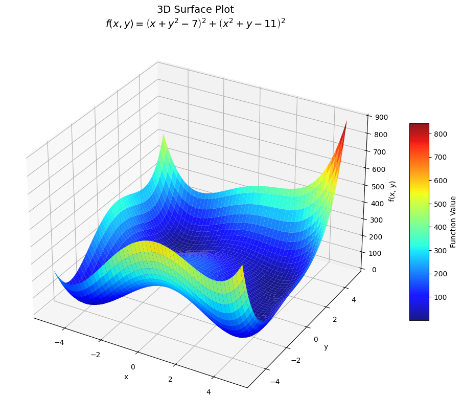
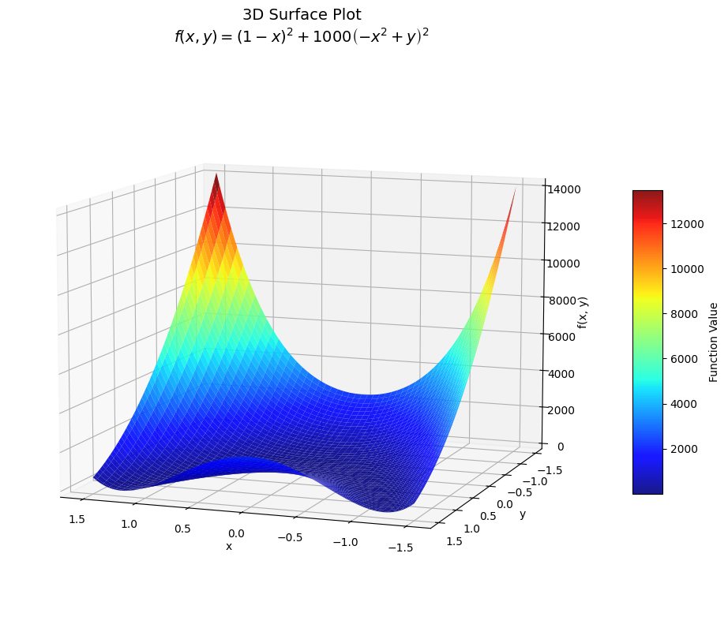
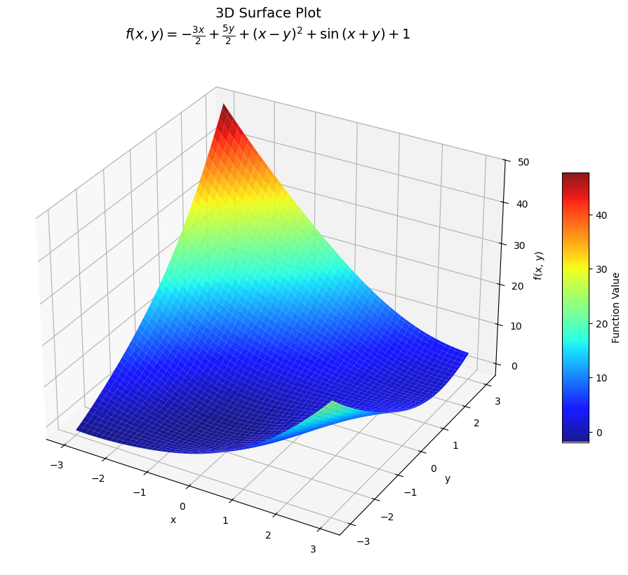
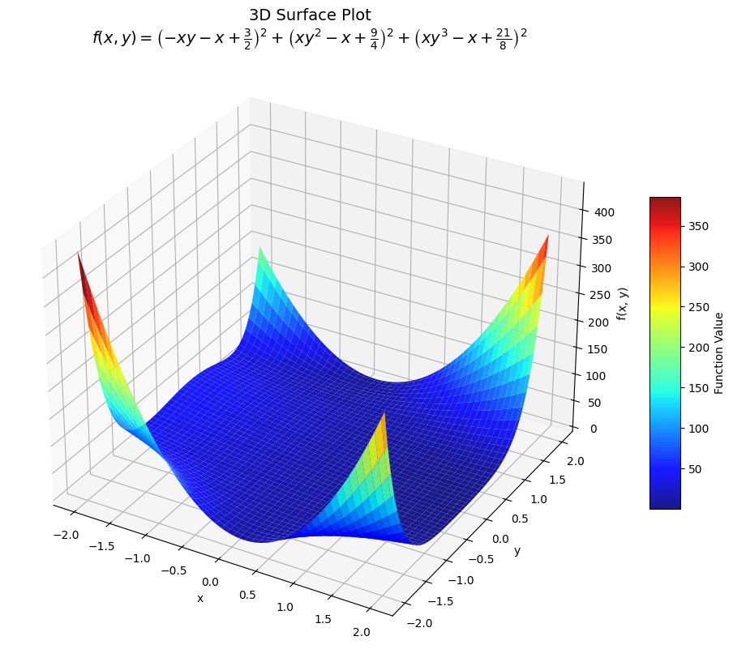
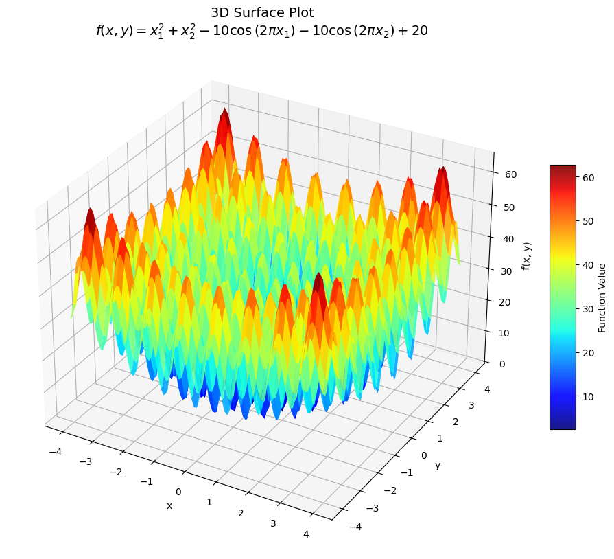

# Nonlinear Optimisation - Finding local minimisers

----

## [Benchmarking Against Challenging Functions](BenchmarkingOne.ipynb)

The objective of this project is to test custom implementations of the Levenberg–Marquardt, and Newton-Raphson methods against [`scipy.optimize.minimize method='BFGS'`](https://docs.scipy.org/doc/scipy-1.15.0/reference/optimize.minimize-bfgs.html) and test performance on a few 'challenging functions' including;

- **Himmelbrau's Function**

$$
f(x, y) = (x^2 + y - 11)^2 + (x + y^2 - 7)^2
$$

- **Powell's Singular Function**

$$
f(\mathbf{x}) = (x_1 + 10x_2)^2 + 5(x_3 - x_4)^2 + (x_2 - 2x_3)^4 + 10(x_1 - x_4)^4
$$

- **McCormick's Function**

$$
f(x, y) = \sin(x + y) + (x - y)^2 - 1.5x + 2.5y + 1
$$

- **Beale's Function**

$$
f(x, y) = \left(1.5 - x + xy\right)^2 + \left(2.25 - x + xy^2\right)^2 + \left(2.625 - x + xy^3\right)^2
$$

- **Rastrigin Function**

$$
f(\mathbf{x})=An + \sum_{i=1}^n \left[x_1^2 - A\cos(2\pi x_1)\right]
$$

for an $n$ dimensional domain

The implementations of LM and NR are detailed below 

----

