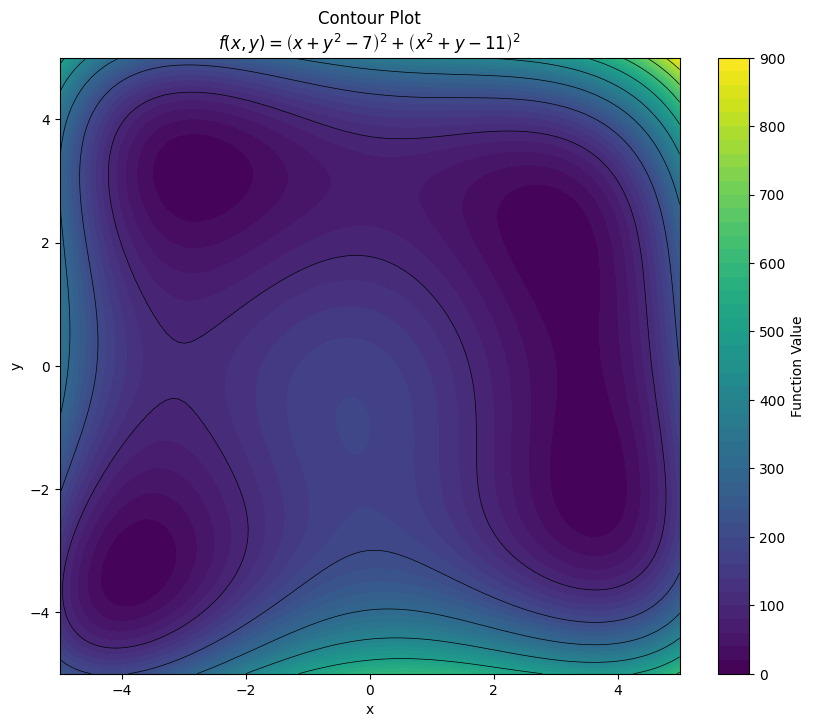
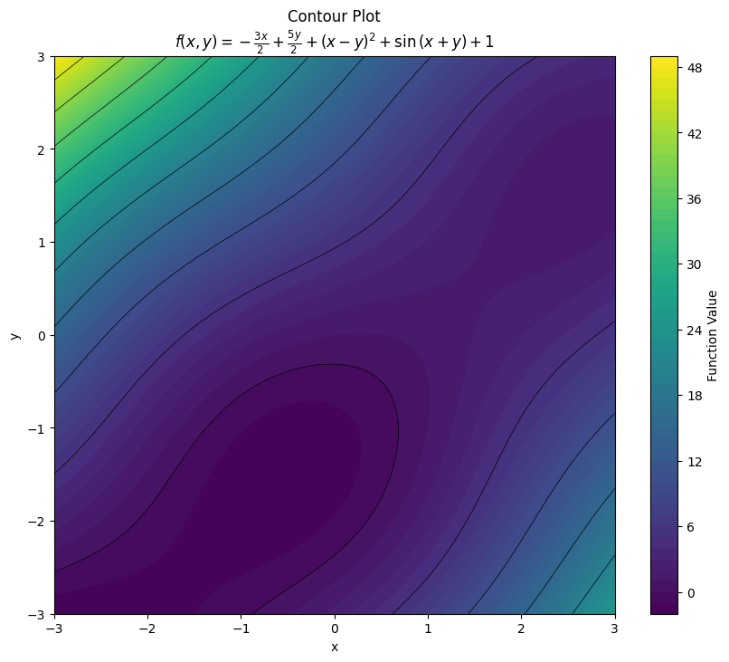
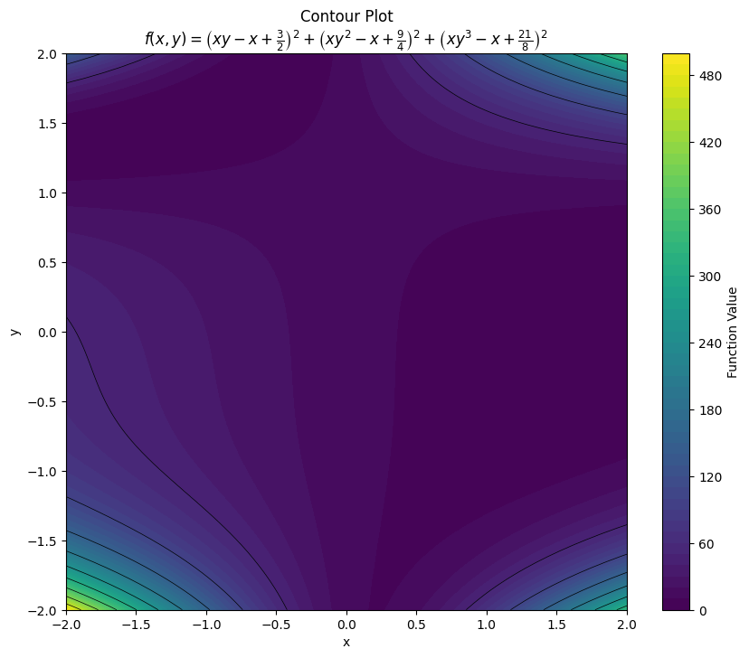
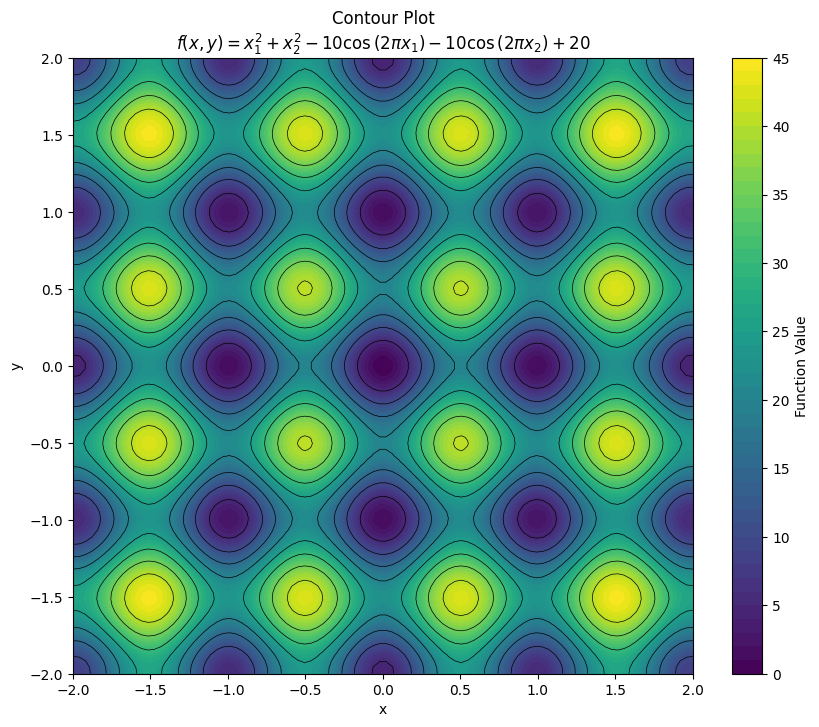

# Nonlinear Optimisation - Finding local minimisers

----

## [Benchmarking Against Challenging Functions](BenchmarkingOne.ipynb)

The objective of this project is to test custom implementations of the Levenberg–Marquardt, and Newton-Raphson methods against [`scipy.optimize.minimize method='BFGS'`](https://docs.scipy.org/doc/scipy-1.15.0/reference/optimize.minimize-bfgs.html) and test performance on a few 'challenging functions' including;

## 1. Himmelbrau's Function

$$
f(x, y) = (x^2 + y - 11)^2 + (x + y^2 - 7)^2
$$

    
    

### Results:

Starting from $\mathbf{x}_0=(0,0)$, (Chosen not to be minimiser by inspection of contour plot)

| Method | Converged | Minimiser $(x, y)$       | $f(x, y)$                | `nit` | `nfev` |
|--------|-----------|--------------------------|--------------------------|-------|--------|
| LM     | Yes       | [3.00000002, 1.99999994] | $4.8675 \times 10^{-14}$ | 9     | 10     | 
| NR     | Yes       | [3.0, 2.0]               | 0.0                      | 12    | 13     | 
| BFGS   | Yes       | [2.99999994, 1.99999999] | $1.3782 \times 10^{-13}$ | 10    | 48     | 

#### Notes:
- **Levenberg-Marquardt**:
  - Minimal function evaluations with `nfev` = 10
  - Final damping parameter $\lambda = 0.00215$

- **BFGS**:
    - Computationally expensive with `nfev` = 48

#### Observations:

- **Sensitivity to Starting Point**:
  - Himmelbrau's function has multiple minima, making the choice of $\mathbf{x}_0$ critical for successful convergence to the intended minimum.
  - Robust methods like Levenberg-Marquardt and BFGS are better suited to handle poor initial guesses compared to Newton-Raphson.

- **Challenges with Himmelbrau's Function**:
  - The Hessian can become poorly conditioned near saddle points, especially for Newton-Raphson, requiring careful handling of numerical stability.
  - Flat regions in the function surface can also delay convergence, particularly for gradient-based methods.

-----

## 2. Powell's Singular Function

$$
f(\mathbf{x}) = (x_1 + 10x_2)^2 + 5(x_3 - x_4)^2 + (x_2 - 2x_3)^4 + 10(x_1 - x_4)^4
$$

### Results

Starting from $\mathbf{x}_0=(3, -1, 0, 1)$, (Standard test starting point)
- The minimiser is $\mathbf{x}=(0,0,0,0)$ with $f(\mathbf{x})=0$

| Method | Converged | Minimiser $(x_1, x_2, x_3, x_4)$            | $f(x)$                  | `nit` | `nfev` |
|--------|-----------|---------------------------------------------|-------------------------|-------|--------|
| LM     | Yes       | [9.789e-6, -9.789e-7, 4.878e-6, 4.878e-6]   | $1.910 \times 10^{-20}$ | 40    | 41     | 
| NR     | Yes       | [8.278e-6, -8.278e-7, 1.324e-6, 1.324e-6]   | $2.352 \times 10^{-20}$ | 31    | 32     | 
| BFGS   | Yes       | [7.615e-4, -7.616e-5, -7.624e-4, -7.624e-4] | $5.835 \times 10^{-11}$ | 43    | 240    | 

#### Notes:
- **Newton-Raphson**:
  - Best overall performer with the fewest iterations (`nit = 31`) and function evaluations (`nfev = 32`).
  - Efficiently handled flat regions, achieving high accuracy.

- **Levenberg-Marquardt**:
  - Performed reliably with slightly more iterations (`nit = 40`) 
  - comparable function value accuracy.

- **BFGS**:
  - Converged, albeit not to the 5.d.p accuracy required.
  - Significantly more function evaluations (`nfev = 240`) with a higher final function value.

#### Key Insight:
- Newton-Raphson was the most efficient and accurate method for Powell's Singular Function, despite its reliance on gradients and Hessians.

#### Challenges:
- The function is convex but has **flat regions** in the search space, causing slow convergence.

----

## 3. McCormick's Function

$$
f(x, y) = \sin(x + y) + (x - y)^2 - 1.5x + 2.5y + 1
$$

    
    

The minimiser of this function is known to be,
$$f(\mathbf{x})=f(-0.54719, -1.54719)=-1.9133$$

### Results:

Testing from three different starting points:

| Starting Point                       | Method | Converged | Minimiser $(x, y)$         | $f(x, y)$       | `nit` | `nfev` |
|--------------------------------------|--------|-----------|----------------------------|-----------------|-------|--------|
| $\mathbf{x}_0 = [-0.5, -1.5]$ (Easy) | LM     | Yes       | [-0.54720, -1.54720]       | -1.91322        | 8     | 9      | 
|                                      | NR     | Yes       | [-0.54720, -1.54720]       | -1.91322        | 3     | 4      | 
|                                      | BFGS   | Yes       | [-0.54720, -1.54720]       | -1.91322        | 5     | 18     | 
| $\mathbf{x}_0 = [1.0, 0.5]$ (Medium) | LM     | Yes       | [-0.54720, -1.54720]       | -1.91322        | 9     | 10     | 
|                                      | NR     | Yes       | [-3.68879, -4.68879]       | -5.05482        | 19    | 20     | 
|                                      | BFGS   | Yes       | [-0.54720, -1.54720]       | -1.91322        | 9     | 33     | 
| $\mathbf{x}_0 = [1.5, 1.5]$ (Hard)   | LM     | Yes       | [2.59440, 1.59440]         | 1.22837         | 9     | 10     | 
|                                      | NR     | Yes       | [5.73599, 4.73599]         | 4.36996         | 35    | 36     | 
|                                      | BFGS   | Yes       | [2.59440, 1.59440]         | 1.22837         | 7     | 24     | 

#### Notes:

- **Easy Case ($\mathbf{x}_0 = [-0.5, -1.5]$)**:
  - Newton-Raphson was the fastest, converging in 3 iterations with 4 function evaluations.
  - Levenberg-Marquardt and BFGS performed well, converging reliably to the global minimum.

- **Medium Case ($\mathbf{x}_0 = [1.0, 0.5]$)**:
  - Newton-Raphson failed to locate the global minimum, instead converging to a spurious point with $f(x, y) = -5.05482$.
  - Levenberg-Marquardt and BFGS successfully reached the global minimum, though BFGS required more evaluations.

- **Hard Case ($\mathbf{x}_0 = [1.5, 1.5]$)**:
  - Newton-Raphson diverged to a local minimum at $f(x, y) = 4.36996$ after 35 iterations.
  - Levenberg-Marquardt and BFGS converged to the same local minimum.

#### Key Insight:

- Newton-Raphson was the fastest for the easy case but failed completely in the medium and hard case.
- Levenberg-Marquardt showed robust and reliable performance for the easy and medium cases.

----

## 4. Beale's Function

$$
f(x, y) = \left(\frac{3}{2} - x + xy\right)^2 + \left(\frac{9}{4} - x + xy^2\right)^2 + \left(\frac{21}{8} - x + xy^3\right)^2
$$

    
    

### Results

Testing from three different starting points:

| Starting Point                    | Method | Converged | Minimiser $(x, y)$     | $f(x, y)$                 | `nit` | `nfev` |
|-----------------------------------|--------|-----------|------------------------|---------------------------|-------|--------|
| $\mathbf{x}_0 = [3, 0.5]$ (Easy)  | LM     | No        | [3.00000, 0.50000]     | 0.00000                   | 100   | 101    | 
|                                   | NR     | Yes       | [3.00000, 0.50000]     | 0.00000                   | 1     | 2      | 
|                                   | BFGS   | Yes       | [3.00000, 0.50000]     | 0.00000                   | 0     | 3      | 
| $\mathbf{x}_0 = [0, -1]$ (Medium) | LM     | Yes       | [3.00000, 0.50000]     | $8.42183 \times 10^{-18}$ | 15    | 16     |
|                                   | NR     | No        | [186.27909, 0.99465]   | 0.44380                   | 100   | 101    | 
|                                   | BFGS   | Yes       | [3.00000, 0.50000]     | $1.70523 \times 10^{-14}$ | 15    | 54     |
| $\mathbf{x}_0 = [-2, 2]$ (Hard)   | LM     | No        | [-351.66015, 1.00281]  | 0.45635                   | 100   | 101    | 
|                                   | NR     | No        | [-4260.20086, 0.99982] | 43.49277                  | 100   | 101    | 
|                                   | BFGS   | No        | [-637.59666, 1.00155]  | 0.45440                   | 166   | 845    | 

#### Notes:
- **Easy Case; $\mathbf{x}_0 = [3, 0.5]$**:
  - Newton-Raphson and BFGS converged rapidly to the exact global minimum.
  - Levenberg-Marquardt failed to converge within the iteration limit (by inspection it's very nearly there)

- **Medium Case; $\mathbf{x}_0 = [0, -1]$**:
  - Levenberg-Marquardt and BFGS both converged to near-zero function values, with BFGS requiring more evaluations.
  - Newton-Raphson failed, diverging to an incorrect point.

- **Hard Case; $\mathbf{x}_0 = [-2, 2]$**:
  - All methods struggled, with neither converging to the global minimum.
  - BFGS showed poor efficiency, requiring 845 function evaluations and failing to achieve the desired tolerance.

#### Key Insight:
- Newton-Raphson performs well near well-behaved regions but fails in complex scenarios.
- Levenberg-Marquardt demonstrates robustness for moderately difficult starting points but struggles in extreme cases.
- BFGS is consistent in finding minimisers but can be computationally expensive in challenging regions.

----

## 5. Rastrigin Function

$$
f(\mathbf{x})=An + \sum_{i=1}^n \left[x_1^2 - A\cos(2\pi x_1)\right]
$$

for an $n$ dimensional domain.

We set $n=2$

    
    

### Results

Testing from $\mathbf{x}_0 = [0.5, 0.5]$:

| Method | Converged | Minimiser $(x_1, x_2)$       | $f(x)$                    | `nit` | `nfev` |
|--------|-----------|------------------------------|---------------------------|-------|--------|
| LM     | Yes       | [-1.77210e-10, -1.77210e-10] | 0.00000                   | 11    | 12     | 
| NR     | Yes       | [7.95923, 7.95923]           | 127.35131                 | 11    | 12     | 
| BFGS   | Yes       | [-7.69975e-09, -7.69975e-09] | $2.48690 \times 10^{-14}$ | 3     | 30     |

#### Notes:
- **Levenberg-Marquardt (LM)**:
  - Successfully converged to the global minimum from a relatively close starting point.
  - Required 12 function evaluations.

- **Newton-Raphson (NR)**:
  - Diverged to a saddle point ($f(x) = 127.35131$), highlighting its susceptibility to poor starting points.
  - Equal function evaluations to LM but failed to locate the global minimum.

- **BFGS**:
  - Converged efficiently to the global minimum with excellent accuracy ($f(x) \approx 2.487 \times 10^{-14}$).
  - Required more function evaluations than LM but fewer iterations overall.

#### Key Insight:
- Newton-Raphson struggles with Rastrigin's Function due to the abundance of local minima and saddle points.
- Both Levenberg-Marquardt and BFGS demonstrated robustness, with BFGS achieving the best accuracy.
- For functions with many local minima, global optimization techniques may be more appropriate.

----

